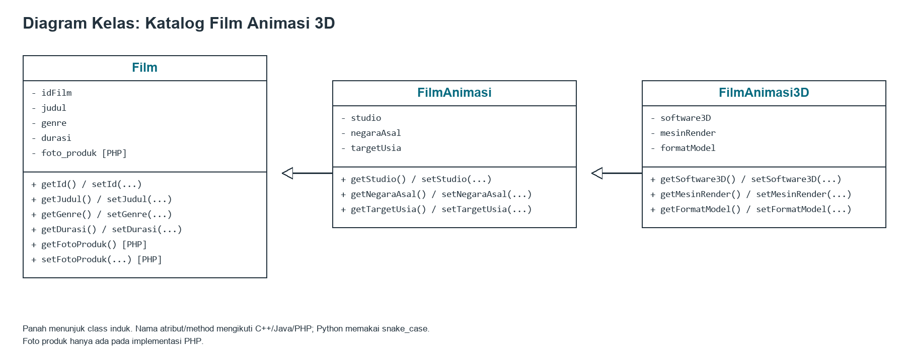
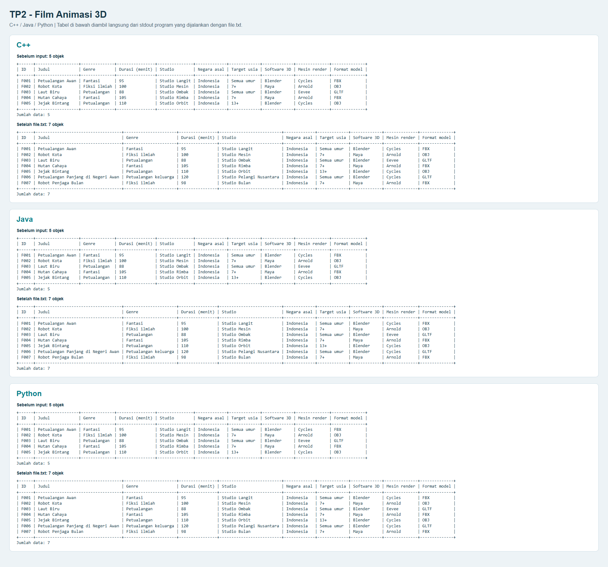
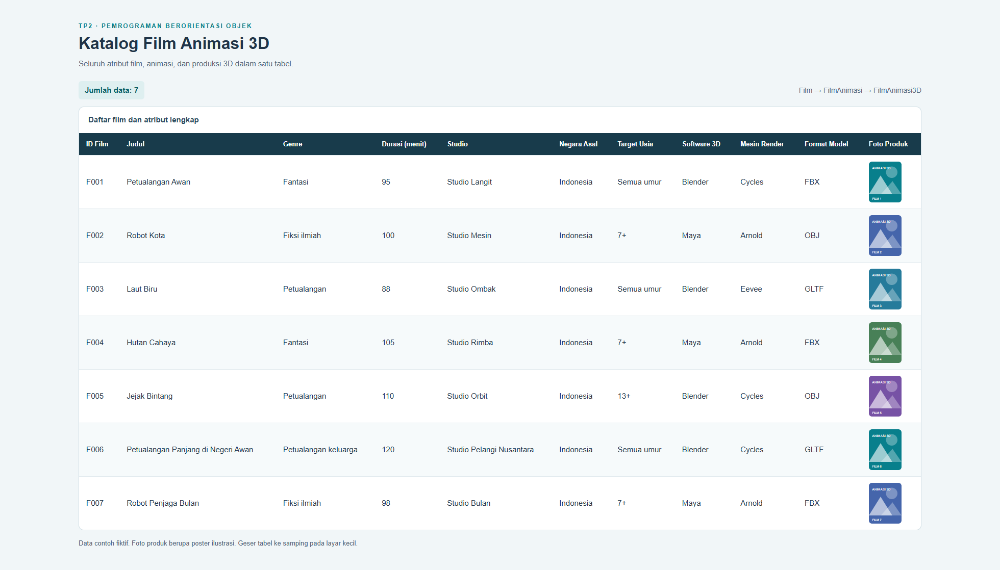

# TP2 DPBO — Katalog Film Animasi 3D

## Janji

Saya **Riza Wahyu Nugraha** dengan **NIM 2511421** mengerjakan **Tugas Praktikum 2** dalam mata kuliah **Desain dan Pemrograman Berorientasi Objek** untuk keberkahan-Nya maka saya tidak melakukan kecurangan seperti yang telah dispesifikasikan. Aamiin.

## Desain diagram class



Panah pewarisan menunjuk ke class induk: **FilmAnimasi → Film** dan **FilmAnimasi3D → FilmAnimasi**. Diagram dibuat dari atribut dan method pada file class. Atribut foto produk serta getter/setter-nya hanya ada di PHP. Python memakai nama snake_case dan constructor __init__; PHP memakai __construct.

## Tema dan materi yang digunakan

TP2 melanjutkan tema film bioskop dari TP1. Sesuai soal, relasinya adalah **multilevel inheritance**: **Film → FilmAnimasi → FilmAnimasi3D**.

- Film adalah karya audiovisual dengan identitas, judul, genre, dan durasi.
- FilmAnimasi adalah jenis film yang dibuat menggunakan animasi.
- FilmAnimasi3D adalah jenis film animasi yang dibuat menggunakan model tiga dimensi.

Hubungannya **is-a**: setiap FilmAnimasi3D adalah FilmAnimasi, dan setiap FilmAnimasi adalah Film. Istilah 3D merujuk pada teknik pembuatan animasi, bukan kewajiban memakai kacamata 3D saat menonton. Seluruh judul dan data produksi di program adalah **contoh fiktif untuk praktikum**.

Implementasi mengikuti pola materi inheritance: class, objek, atribut private, constructor, getter, setter, dan pewarisan bertingkat. Pengolahan input dan tabel memakai fungsi, percabangan, perulangan, serta list/array. Setiap class berada di **file sendiri**, dengan satu file main untuk menjalankan program.

## Penjelasan atribut

| Class pemilik | Atribut | Tipe | Keterangan |
| --- | --- | --- | --- |
| Film | idFilm / id_film | Teks | ID unik, peka huruf besar-kecil, misalnya F001. |
| Film | judul | Teks | Judul film, boleh mengandung spasi. |
| Film | genre | Teks | Genre film. |
| Film | durasi | Integer | Lama film dalam menit, 1–999. |
| Film | foto_produk | Teks, PHP saja | Data gambar poster ilustrasi SVG untuk kolom foto. |
| FilmAnimasi | studio | Teks | Studio pembuat animasi. |
| FilmAnimasi | negaraAsal / negara_asal | Teks | Negara asal produksi. |
| FilmAnimasi | targetUsia / target_usia | Teks | Sasaran penonton, misalnya Semua umur atau 7+. |
| FilmAnimasi3D | software3D / software_3d | Teks | Perangkat lunak pembuatan animasi 3D. |
| FilmAnimasi3D | mesinRender / mesin_render | Teks | Perangkat lunak untuk menghasilkan gambar dari adegan 3D. |
| FilmAnimasi3D | formatModel / format_model | Teks | Format berkas model 3D dalam produksi. |

Masing-masing class mendeklarasikan **4, 3, dan 3 atribut** sendiri. FilmAnimasi3D memiliki total **10 atribut**, atau **11 pada PHP**. Semua atribut private; Python menggunakan awalan `__`. Kelima objek awal adalah FilmAnimasi3D sehingga seluruh atribut ketiga class dapat ditampilkan pada setiap baris tabel.

## Penjelasan per class

### Film

Class induk untuk semua film. Class ini menyimpan ID, judul, genre, dan durasi. Getter dan setter untuk empat atribut tersebut dipakai oleh semua objek turunannya. Implementasi PHP menambahkan foto produk beserta getter dan setter khusus untuk kolom gambar.

### FilmAnimasi

Turunan Film yang menambahkan studio, negara asal, dan target usia. Constructor menyiapkan atribut miliknya sendiri serta memanggil constructor Film. Objek FilmAnimasi dapat memakai getter dan setter Film melalui pewarisan.

### FilmAnimasi3D

Turunan FilmAnimasi yang menambahkan software 3D, mesin render, dan format model. Class ini mewarisi seluruh atribut dan method FilmAnimasi serta Film. Lima objek awal dan objek baru pada program dibuat sebagai FilmAnimasi3D.

## Penjelasan methods dan fungsi

### Methods class

Setiap constructor tanpa parameter memberi nilai awal kosong pada atribut teks dan nol pada durasi. Constructor parent juga dijalankan untuk menyiapkan atribut yang diwarisi.

Setter `set...` mengisi satu atribut, sedangkan getter `get...` mengambil satu atribut. Setiap class hanya mendefinisikan getter/setter untuk atribut miliknya sendiri. FilmAnimasi3D dapat memakai method dari Film dan FilmAnimasi karena pewarisan.

Contoh Python:

```python
film = FilmAnimasi3D()
film.set_judul("Petualangan Awan")  # Method dari Film.
film.set_studio("Studio Langit")   # Method dari FilmAnimasi.
film.set_mesin_render("Cycles")    # Method milik FilmAnimasi3D.
print(film.get_judul())
```

Daftar pasangan getter/setter tercantum pada diagram. Setter dipakai ketika objek baru diisi, bukan sebagai fitur edit data. Menu program tetap **Add saja**.

### Fungsi di main

| Fungsi | Kegunaan |
| --- | --- |
| `buatFilm()` / `buat_film()` | Membuat objek FilmAnimasi3D, mengisi seluruh atribut melalui setter milik sendiri dan yang diwarisi, lalu mengembalikannya. |
| `ambilBaris()` (C++/Java), `baris_film()` (Python), `barisFilm()` (PHP) | Mengambil sepuluh atribut melalui getter untuk satu baris tabel. Foto PHP diambil dengan `getFotoProduk()`. |
| `tampilkanTabel()` / `tampil_tabel()` | Menghitung lebar maksimum header dan isi, lalu mencetak seluruh data dalam satu tabel CLI. |
| `cetakGaris()` / `cetak_garis()` | Mencetak pembatas tabel berdasarkan lebar setiap kolom. |
| `bacaTeks()` / `baca_teks()` | Membaca satu baris, memangkas spasi tepi, menolak teks kosong/karakter kontrol, dan mengenali akhir input. |
| `trim()` pada C++ | Memangkas spasi di awal dan akhir input. |
| `tambahFilm()` / `tambah_film()` | Memeriksa ID unik, membaca atribut, memvalidasi durasi, lalu menambahkan objek lengkap. |
| `gagalInput()` pada PHP | Menampilkan alasan input testcase ditolak dan menghentikan program. |
| `aman()` pada PHP | Mengamankan karakter khusus untuk ditampilkan sebagai teks HTML. |
| `buatPoster()` pada PHP | Membuat gambar poster ilustrasi tanpa file gambar atau internet. |
| `main()` / `Main.main()` | Menyiapkan lima objek awal dan menjalankan menu. Bagian utama PHP berada setelah definisi fungsi. |

Data disimpan sebagai kumpulan objek: `vector` pada C++, `ArrayList` pada Java, `list` pada Python, dan array pada PHP. Data tambahan CLI hilang setelah program ditutup.

## Alur program

1. Main membuat lima objek awal F001–F005 melalui fungsi pembantu `buatFilm()` atau `buat_film()`, sebelum menerima input.
2. Seluruh atribut dari ketiga class ditampilkan dalam **satu tabel**.
3. C++/Java/Python menyediakan menu `1. Tambah` dan `0. Keluar`.
4. Tambah meminta ID, judul, genre, durasi, studio, negara asal, target usia, software 3D, mesin render, dan format model.
5. ID duplikat dikembalikan ke menu. Teks kosong dan durasi salah diminta ulang. Durasi harus satu sampai tiga digit ASCII dengan nilai 1–999.
6. Setelah lengkap, program membuat objek baru, mengisi atribut dengan setter, menyimpannya, dan mencetak ulang tabel. Lebar tabel dihitung ulang agar judul panjang tidak terpotong.
7. Pilihan `0` atau akhir input (EOF) mengakhiri program. Input yang terputus tidak menghasilkan objek setengah lengkap.

**PHP:** halaman web menampilkan lima objek awal dan menyediakan form interaktif untuk menambah data secara langsung melalui browser (disimpan dinamis pada session), lengkap dengan validasi dan tombol reset data awal. Selain itu, mode CLI menerima `file.txt` untuk pengujian otomatis sebelum menghasilkan tabel HTML (`php Main.php file.txt > hasil.html`). Tabel memiliki lebar dinamis dan scroll horizontal pada layar kecil.

## Struktur folder

Setiap folder bahasa berisi **tiga file class, satu main, dan satu testcase**:

```text
tp2/
├── CPP/
│   ├── Film.cpp
│   ├── FilmAnimasi.cpp
│   ├── FilmAnimasi3D.cpp
│   ├── main.cpp
│   └── file.txt
├── Java/
│   ├── Film.java
│   ├── FilmAnimasi.java
│   ├── FilmAnimasi3D.java
│   ├── Main.java
│   └── file.txt
├── Python/
│   ├── Film.py
│   ├── FilmAnimasi.py
│   ├── FilmAnimasi3D.py
│   ├── main.py
│   └── file.txt
├── PHP/
│   ├── Film.php
│   ├── FilmAnimasi.php
│   ├── FilmAnimasi3D.php
│   ├── Main.php
│   └── file.txt
├── Dokumentasi/
│   ├── CLI.png
│   └── PHP.png
├── desain.png
├── .gitignore
└── README.md
```

Java memiliki class Main sebagai tempat menjalankan program; tiga class yang merepresentasikan objek tetap Film, FilmAnimasi, dan FilmAnimasi3D. Pada C++, file class disertakan dengan `#include`, mengikuti pola materi kuliah; cukup kompilasi `main.cpp`. Python memakai `import`, PHP memakai `require_once`.

## Cara menjalankan

Mulai dari folder `tp2`. Contoh berikut untuk **PowerShell di Windows**. Program hanya memakai pustaka bawaan bahasa.

### C++

```powershell
g++ -std=c++11 -Wall -Wextra CPP/main.cpp -o CPP/main.exe
.\CPP\main.exe
# Testcase:
Get-Content CPP/file.txt | .\CPP\main.exe
```

### Java

```powershell
New-Item -ItemType Directory -Force Java/build | Out-Null
javac -encoding UTF-8 -d Java/build Java/Film.java Java/FilmAnimasi.java Java/FilmAnimasi3D.java Java/Main.java
java -cp Java/build Main
# Testcase:
Get-Content Java/file.txt | java -cp Java/build Main
```

### Python

```powershell
python Python/main.py
# Testcase:
Get-Content Python/file.txt | python Python/main.py
```

### PHP

```powershell
# Jika PHP tersedia di PATH, cukup gunakan php.
& C:\php\php.exe -S localhost:8000 -t PHP
```

Buka **http://localhost:8000/Main.php**. Hentikan server dengan `Ctrl+C`.

Untuk menjalankan testcase, gunakan terminal lain:

```powershell
& C:\php\php.exe PHP/Main.php PHP/file.txt | Set-Content -Encoding UTF8 PHP/hasil.html
```

Buka **http://localhost:8000/hasil.html** untuk melihat tujuh objek. File hasil.html hanya hasil eksekusi, tidak perlu dikumpulkan.

Pada Bash/Linux, gunakan pengalihan input seperti `python3 Python/main.py < Python/file.txt`, `./CPP/main < CPP/file.txt`, atau `java -cp Java/build Main < Java/file.txt` setelah kompilasi. Untuk PHP: `php PHP/Main.php PHP/file.txt > PHP/hasil.html`.

Jangan unggah file hasil kompilasi seperti `.class`, `.o`, dan `.exe`. File `.gitignore` juga mengecualikan cache Python, folder build, dan HTML hasil testcase.

## Testcase

Keempat bahasa mempunyai `file.txt`. Pada C++/Java/Python, input terdiri dari menu `1`, sepuluh nilai atribut (satu per baris), lalu penambahan kedua dan menu `0`. PHP memakai satu objek per baris dengan sepuluh atribut dipisahkan `|`; foto dibuat otomatis.

| Objek | Judul | Tujuan |
| --- | --- | --- |
| F006 | Petualangan Panjang di Negeri Awan | Menguji teks berspasi dan kolom yang melebar. |
| F007 | Robot Penjaga Bulan | Menguji penambahan berikutnya tanpa kehilangan data sebelumnya. |

CLI menampilkan **5 objek** sebelum input, **6** setelah penambahan pertama, lalu **7** setelah penambahan kedua. PHP biasa menampilkan **5**, dan mode testcase menampilkan **7**. Seluruh atribut tetap dalam satu tabel.

Validasi juga diuji dengan ID duplikat, teks kosong, karakter kontrol, durasi nol/negatif/desimal/huruf/lebih dari 999, angka sangat panjang, menu tidak dikenal, dan EOF saat pengisian. Durasi batas 1 dan 999 diterima. PHP diperiksa untuk file hilang, baris tidak lengkap, dan karakter HTML.

Gunakan font monospace dan jendela terminal cukup lebar. Karakter berlebar khusus seperti emoji/CJK dapat kurang sejajar karena tabel memakai panjang string bawaan bahasa; testcase menggunakan teks Latin/ASCII.

## Dokumentasi

Screenshot dibuat dari program yang dijalankan. CLI.png berisi tabel awal dan akhir C++, Java, serta Python, diambil dari stdout aktual lalu ditampilkan di browser agar semua kolom terbaca. Hanya bagian tabel dipilih; teks tabel tidak diketik ulang. PHP.png menampilkan HTML aktual dari testcase, termasuk tujuh objek dan foto.

### C++, Java, dan Python



[Buka screenshot CLI ukuran penuh](Dokumentasi/CLI.png).

### PHP



[Buka screenshot PHP ukuran penuh](Dokumentasi/PHP.png).
